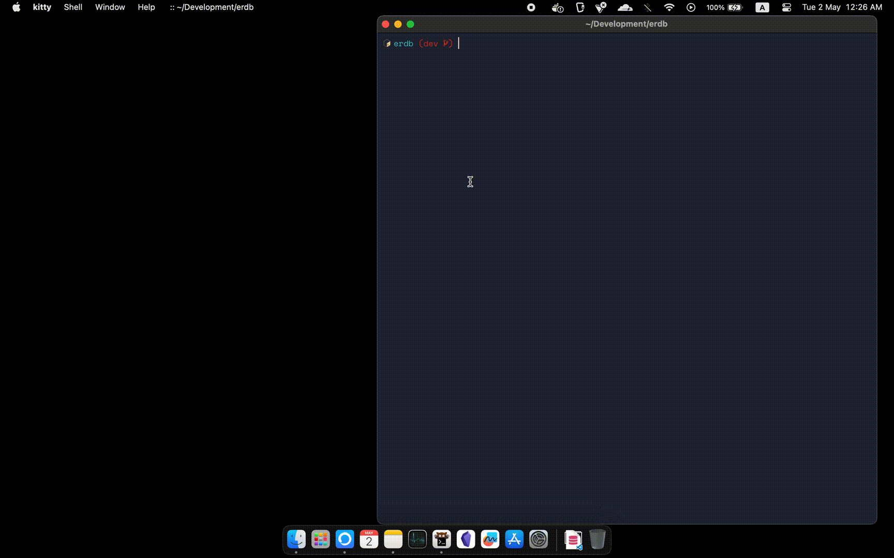

# ERDB [](https://badge.fury.io/rb/erdb) [](https://github.com/rubocop/rubocop)

ERDB is a Ruby Gem for generation Entity-Relationship Diagrams (ERD).
Currently it support `sqlite3`, `mysql2` and `postgresql` database.
ERDB is just a wrapper to automate the process of generating ERD using -

- [Azimutt(Open Source)](https://azimutt.app)
- [DBDiagram](https://dbdiagram.io)

> Currently there is no support for `one-to-one` relationship. If you want to use it you have to manually edit the generated ERD.

<!-- graphviz coming soon -->

## Demo



## Requirements

- Ruby 2.7.0 or higher
- Chrome Browser.

## Installation

Use the package manager [gem](https://rubygems.org/) to install ERDB.

```bash
gem install erdb
```

> Important note for Linux users: The clipboard requires the _xsel_ or the _xclip_ command-line program. On debian and ubuntu, _xsel_ can be installed with: `sudo apt-get install xsel`
> Visit [clipboard](https://github.com/janlelis/clipboard) for more details.

#### Adapters

For `mysql2` and `postgresql` database, you have to install the required gem.
I didn't include them in the gemspec because I don't want to install them if you don't need them.
Because it depends on native extensions, you'll need a compiler and the development headers for your Ruby and database.

```bash
gem install mysql2
gem install pg
```

## Usage

After install ERDB, you can use `erdb` command to generate ER Diagram.

```bash
erdb
```

## Why I created this gem?

I know there are many tools available for generating ERD,
but I wanted to create a tool that is easy to use and can be used with any database.
`Azimutt` also support converting schema to ERD, but it's only working well with remote databases.
If I want to generate local database using `Azimutt`, I have to setup `Azimutt` locally that is alot of step -\_-

## Roadmap

- [x] Support `sqlite3`, `mysql2` and `postgresql` database.
- [x] Generate ERD using Azimutt
- [x] Generate ERD using DBDiagram
- [ ] Support `MongoDB` database.

## Contributing

Pull requests are welcome. Feel free to open an issue first to discuss what you would like to change.

## License

This project is licensed under [MIT](https://choosealicense.com/licenses/mit/) license.
View [LICENSE](./LICENSE) for more details.
